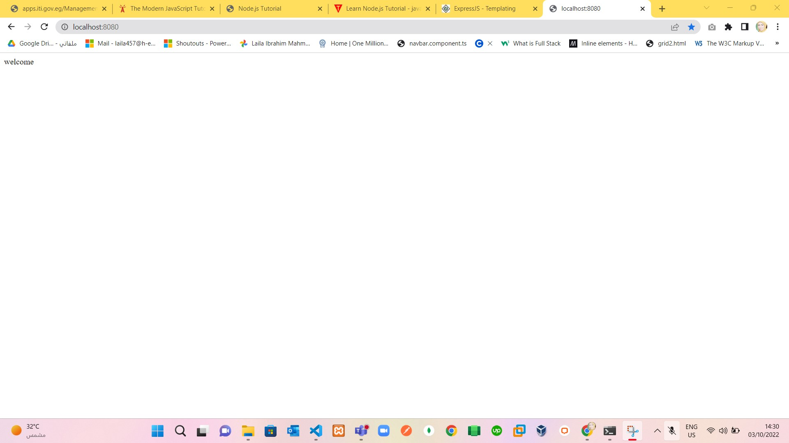

# Part 1: 
# Contact CRUD System 
> notes:
 1. Install and using `express()` to create server.
 2. make Routing.
 3. install nodemon to follow up any change.
 4. create views(`addContact.html` For add New Contact,`editContact.html` for edit existing contact ,`home` for show all contacts & make actions & search contact ).
 5. Install and Add `body-parser`, Body-parser is a middleware. They help to tidy up the request object before we use them. Express lets us use middleware with the use method. The urlencoded method within body-parser tells body-parser to extract data from the <form> element and add them to the body property in the request object.
 6. You should be able to see values from the <form> element inside req.body now. Try doing a console.log and see what it is!.
 7. use fs to handle with files.

> Solve: 
 1. Index page `/` to get all contacts :) as in:
  
 2. search on `l` to get contact with `l` character as in: 
  
 3. try to edit `laila` contact by click on `edit` button and edit and return to home as in:
  
 4. remove `omar` contact by click on `delete` button and return to home as in:
  
<!-- ****************************************** -->
# Part 2 (Lab2 Rest WS for Phonebook):
 Create Rest web service using NodeJS and Express
 For Phonebook getting list of Contacts, get contact by id , add and delete contact
 Use files to save the data
 Contact will has (name, phone) properties.

> notes:
 1. create `phonebookWS.js`
 2. use express, body-parser,fs and listen to port `8080`
 3. testing using handler `/` and all is work as in :
   
 4. stop until Now and I will return to it :) 